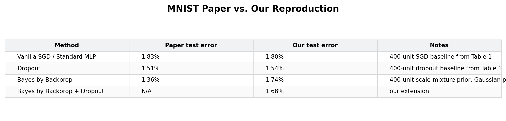
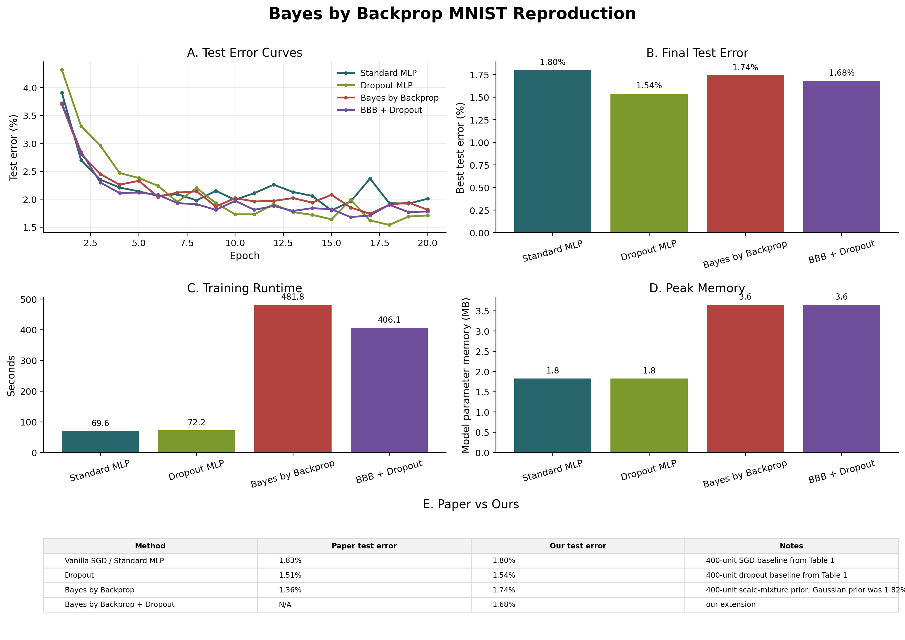

# Bayes by Backprop Reimplementation

## 1. Introduction

This repo is a CS 4782 final project that re-implements and extends the Bayes by Backprop experiments from Blundell et al., *Weight Uncertainty in Neural Networks*.

The paper's main contribution is a variational Bayesian training method for neural networks that learns a distribution over weights, enabling uncertainty-aware prediction while remaining competitive with dropout-style regularization.

## 2. Chosen Result

We aimed to reproduce the MNIST classification comparison from the paper's Table 1 and Figure 2, where Bayes by Backprop with a scale-mixture prior is compared against vanilla SGD and dropout.



## 3. GitHub Contents

`code/` contains the Bayes by Backprop implementation, training scripts, evaluation scripts, and Kalman/trust extensions; `results/` stores generated CSVs, plots, and summaries; `report/` and `poster/` contain final writeups.

Core files: `code/bayes_by_backprop/` for models/layers/losses, `code/experiments/` for runnable experiments, `code/evaluation/` for plots, and `results/reproduction/` for final reproduction artifacts.

## 4. Re-implementation Details

We implemented a two-hidden-layer 400-unit MNIST MLP in four variants: standard MLP, dropout MLP, Bayes by Backprop with BayesianLinear layers and a scale-mixture prior, and Bayes by Backprop + dropout.

Experiments use PyTorch/torchvision, Adam, batch size 128, a 54k/6k train/validation split, MNIST test accuracy/error, runtime, and model-parameter memory; our main modification is a shorter 20-epoch training budget plus exploratory uncertainty/trust extensions.

## 5. Reproduction Steps

Create the environment and install dependencies:

```bash
python3 -m venv .venv
source .venv/bin/activate
pip install -r code/requirements.txt
```

Run the main reproduction and regenerate plots:

```bash
python code/experiments/run_missing_reproduction_experiments.py --epochs 20 --batch-size 128 --lr 1e-3 --seeds 0 --device auto
python code/evaluation/make_reproduction_plots.py
```

Single-model examples:

```bash
python code/experiments/train_mnist.py --model standard --epochs 10
python code/experiments/train_mnist.py --model dropout --epochs 10
python code/experiments/train_mnist.py --model bayesian --epochs 10 --mc-samples 10
python code/experiments/train_mnist.py --model bayesian --bayesian-dropout 0.1 --epochs 10 --mc-samples 10
```

The code runs on CPU, but a CUDA GPU is recommended for faster Bayesian runs; in our 20-epoch CPU-style run, Bayes by Backprop took about 482 seconds versus about 70-72 seconds for deterministic/dropout baselines.

## 6. Results/Insights

| Method | Paper test error | Our best test error |
| --- | ---: | ---: |
| Vanilla SGD / Standard MLP | 1.83% | 1.80% |
| Dropout | 1.51% | 1.54% |
| Bayes by Backprop | 1.36% | 1.74% |
| Bayes by Backprop + Dropout | N/A | 1.68% |



Bayes by Backprop qualitatively reproduced the paper's core claim by staying competitive with dropout on MNIST, but exact matching is limited by our shorter training budget and smaller hyperparameter search.

## 7. Conclusion

The re-implementation confirms the main lesson of the paper: Bayesian weight uncertainty can produce dropout-competitive MNIST performance, though it costs substantially more runtime and memory because each Bayesian layer stores and samples posterior parameters.

Our extension with dropout inside the Bayesian model improved over plain Bayes by Backprop in this run, but did not beat dropout alone, suggesting the accuracy-cost tradeoff remains the central practical tension.

## 8. References

- Charles Blundell, Julien Cornebise, Koray Kavukcuoglu, and Daan Wierstra. *Weight Uncertainty in Neural Networks*. ICML 2015.
- Paper copy used for this project: `report/references/weight_uncertainty_in_neural_networks.pdf`.
- PyTorch and torchvision documentation for model implementation and MNIST loading.

## 9. Acknowledgements

This project was completed for Cornell CS 4782 Deep Learning, Spring 2026.

Thanks to the course staff and project reviewers for the reproduction-focused assignment structure and feedback context.
